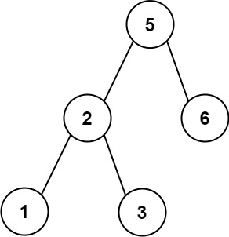

# [255.验证二叉搜索树的前序遍历序列](https://leetcode.cn/problems/verify-preorder-sequence-in-binary-search-tree/?envType=study-plan-v2&envId=premium-algo-100)

## 题目

给定一个**无重复元素**的整数数组 `preorder` ， 如果它是以二叉搜索树的_先序遍历_排列 ，返回`true`。

**Example 1:**

    Input: preorder = [5,2,1,3,6]
    Output: true

**Example 2:**

    Input: root = [5,2,6,1,3]
    Output: false

**Note:**
- `1 <= preorder.length <= 10^4`
- `1 <= preorder[i] <= 10^4`
- `preorder` 中**无重复元素**

## 算法思路

### 1. 前序遍历的特点：

- 二叉搜索树的前序遍历顺序是：根节点 → 左子树 → 右子树。
- 在前序遍历中，根节点的值会先出现，随后所有左子树的值会小于根节点，右子树的值会大于根节点。
- 对于每个子树的范围，可以用一个变量 low 记录当前子树的最小值约束。

### 2. 模拟树的构造：

- 使用一个栈模拟前序遍历的节点构造过程。
- 遍历数组 preorder，每个元素 v 都可以被认为是当前节点：
  - 如果 v 小于 low，说明破坏了二叉搜索树的性质，返回 false。
  - 如果 v 大于栈顶元素，说明进入了右子树，弹出栈顶元素并更新 low 为弹出的值。
  - 将当前元素 v 压入栈中，表示还在处理当前子树。

## 3. 遍历结束：

- 如果整个数组都满足上述条件，则说明该数组可以是某棵二叉搜索树的前序遍历。
