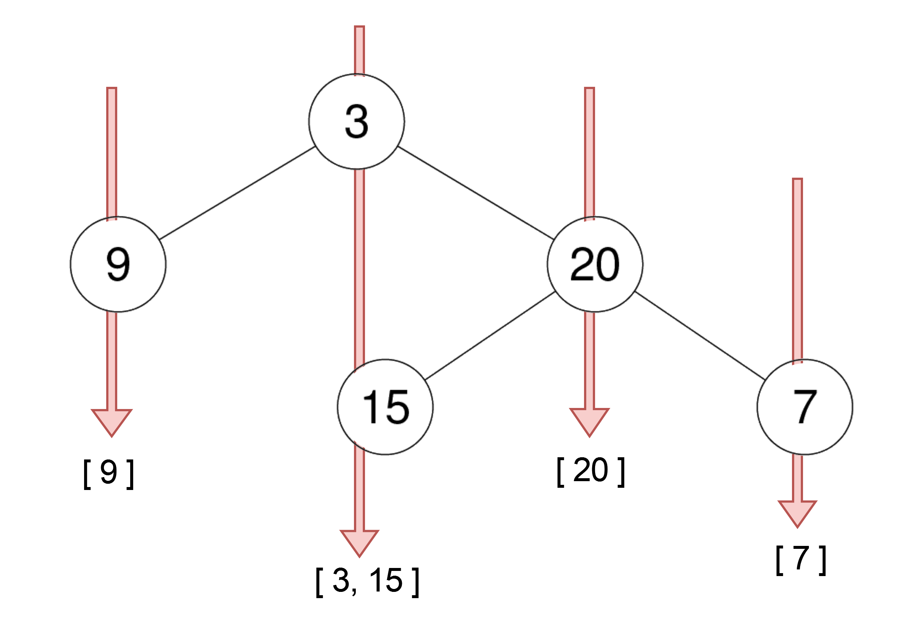
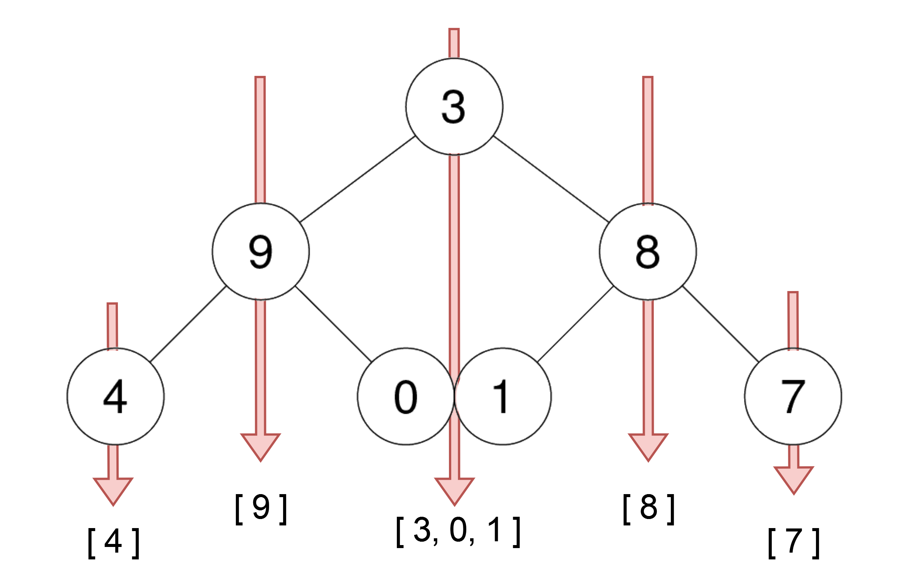
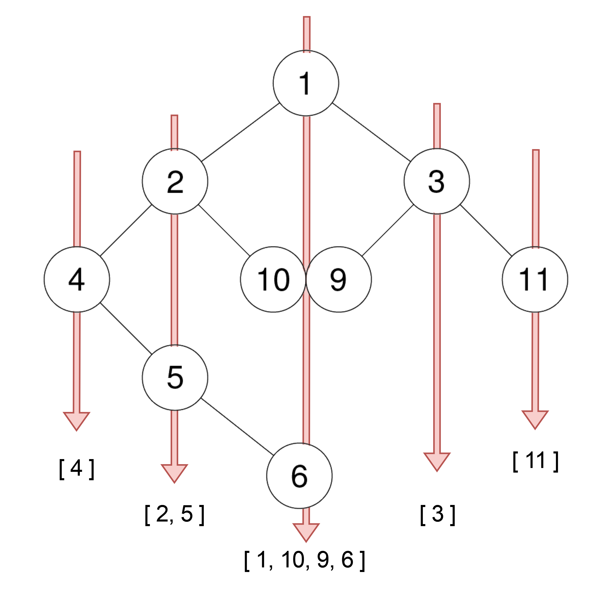

# [314.二叉树的垂直遍历](https://leetcode-cn.com/problems/binary-tree-vertical-order-traversal/)

## 题目

给你一个二叉树的根结点，返回其结点按垂直方向（从上到下，逐列）遍历的结果。
如果两个结点在同一行和列，那么顺序则为 从左到右。

**Example 1:**

    Input: root = [3,9,20,null,null,15,7]
    Output: [[9],[3,15],[20],[7]]

**Example 2:**

    Input: root = [3,9,8,4,0,1,7]
    Output: [[4],[9],[3,0,1],[8],[7]]

**Example 3:**

    Input: root = [1,2,3,4,10,9,11,null,5,null,null,null,null,null,null,null,6]
    Output: [[4],[2],[1,5,6],[3],[10],[9],[11]]

**Note:**
- 树中结点的数目在范围 **[0, 100]** 内
- **-100 <= Node.val <= 100**

## 算法思路

### 定义垂直列的概念
- 每一个节点有一个列编号col
- 根节点的col为0
- 左子节点的col为col-1
- 右子节点的col为col+1

### BFS + 列分类
- 使用队列层序遍历，每次遍历记录节点的col
- 使用哈希表将节点值存储到相应的列号中
- 每次处理完节点后，将其左右子节点加入队列，更新列号

### 排序列并输出
- 根据列号的顺序（从小到大）输出每列的节点值
- 如果同一列的节点位于同一行，则按从左到右的顺序排列